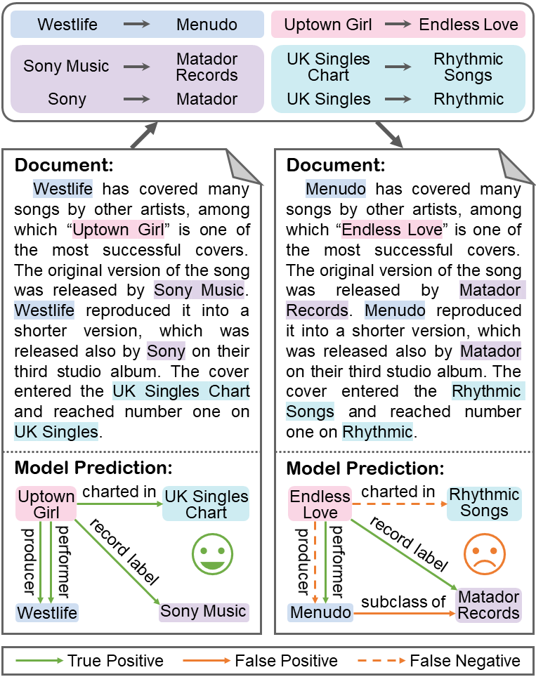

# Env-DocRE: On the Robustness of DocRE Models to Entity Name Variations

This repository contains the data and code for paper [On the Robustness of Document-Level Relation Extraction Models to Entity Name Variations](https://arxiv.org/abs/2406.07444).

## Quick Links

- [Overview](#Overview)
- [Setup](#Setup)
  - [Install dependencies](#Install-dependencies)
  - [Download the datasets](#Download-the-datasets)
- [Datasets](#Datasets)
  - [DocRED](#DocRED)
  - [Re-DocRED](#Re-DocRED)
  - [Env-DocRED](#Env-DocRED)
  - [Env-Re-DocRED](#Env-Re-DocRED)
- [Quick Start](#Quick-Start)
- [Citation](#Citation)

## Overview



In this work, we systematically investigate the robustness of document-level relation extraction (DocRE) models to entity name variations. We first propose a principled pipeline to generate entity-renamed documents by replacing the original entity names with names from Wikidata. By applying the pipeline to DocRED and Re-DocRED datasets, we construct two novel benchmarks named Env-DocRED and Env-Re-DocRED for robustness evaluation. Experimental results show that both three representative DocRE models and two in-context learned large language models consistently lack sufficient robustness to entity name variations, particularly on cross-sentence relation instances and documents with more entities. Finally, we propose an entity variation robust training method which not only improves the robustness of DocRE models but also enhances their understanding and reasoning capabilities. We further verify that the basic idea of this method can be effectively transferred to in-context learning for DocRE as well.

You can find more details of this work in our [paper](https://arxiv.org/abs/2406.07444).

## Setup

### Install dependencies

To run the code, please install the following dependency packages:

- apex (0.1)
- numpy (1.21.6)
- openai (1.10.0)
- opt-einsum (3.3.0)
- torch (>=1.9.0)
- tqdm (4.64.0)
- transformers (>=3.4.0)
- ujson (5.4.0)

### Download the datasets

Please download the zip file of all datasets used in experiments from https://drive.google.com/file/d/1tU6v_eHfTvT01uMnvWhrV0mdb5OdezjD/view?usp=sharing and unzip it into the `datasets` directory.

## Datasets

### DocRED

[DocRED](https://github.com/thunlp/DocRED) is one of the largest and most popular public document-level relation extraction datasets, which is collected from English Wikipedia documents. The relevant data files are located in `datasets/docred` directory.

### Re-DocRED

[Re-DocRED](https://github.com/tonytan48/Re-DocRED) is a revised version of DocRED, resolving the incomplete annotation issue in DocRED. The relevant data files are located in `datasets/re-docred` directory, and the corresponding test prompts for LLMs' in-context learning are located in `datasets/vanilla(evr)_prompts/1(3)-shot/re-docred` directory.

### Env-DocRED

Env-DocRED is constructed by iterating over the development and test sets of DocRED and applying the proposed construction pipeline five times on each document with different random seeds. The relevant data files are located in `datasets/env-docred` directory.

### Env-Re-DocRED

Env-Re-DocRED is constructed by iterating over the development and test sets of Re-DocRED and applying the proposed construction pipeline five times on each document with different random seeds. The relevant data files are located in `datasets/env-re-docred` directory, and the corresponding test prompts for LLMs' in-context learning are located in `datasets/vanilla(evr)_prompts/1(3)-shot/env-re-docred` directory.

## Quick Start

In `evrt` directory, we provide the implementation of `NCRL + EVRT` model to demonstrate how to apply the proposed entity variation robust training method (EVRT) to DocRE model NCRL. The core modifications of EVRT method to the original model are mainly in lines 31-40 and 54-69 of `evrt/main.py`. One can enhance the robustness of a specific DocRE model in a similar manner.

In `scripts` directory, we provide the example scripts for running the experiments. For example, you can use the following command to train and evaluate `NCRL-BERT + EVRT` model on `Env-DocRED` benchmark:

```bash
sh scripts/run_env-docred_bert.sh <device_id> <log_file_name>
# like sh scripts/run_env-docred_bert.sh 0 env-docred_bert
```

You can also comment the `--evrt` argument to switch to the original model without entity variance robust training. Note that since the evaluation on DocRED's test set is conducted via submission to [Codalab](https://codalab.lisn.upsaclay.fr/competitions/365), when evaluating on Env-DocRED's test set, the generated prediction results need to be split into five parts (details in `split_result.py`) for separate submission, and the final score is the average of five submissions.

We also provide the scripts for running the experiments of in-context learning. For example, you can use the following command to generate the prediction results of `gpt-3.5-turbo-0125` model with and without entity variance robust in-context learning on `Env-Re-DocRED` benchmark:

```bash
sh scripts/run_env-re-docred_gpt-3.5.sh <openai_api_key>
```

Then you can use `icl/evaluation.py` to evaluate the prediction results.

## Citation

Please kindly cite our paper if you use the data or code of Env-DocRE in your work:

```bibtex
@misc{meng2024robustness,
      title={On the Robustness of Document-Level Relation Extraction Models to Entity Name Variations}, 
      author={Shiao Meng and Xuming Hu and Aiwei Liu and Fukun Ma and Yawen Yang and Shuang Li and Lijie Wen},
      year={2024},
      eprint={2406.07444},
      archivePrefix={arXiv},
      primaryClass={cs.CL}
}
```

